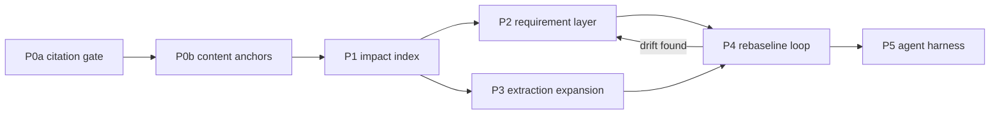

---
todos:
  - id: p0a
    content: "P0a Citation resolution gate: every cited file exists, every line in range; provenance_lint in gate.sh"
    status: completed
  - id: p0b
    content: "P0b Content anchors on Evidence/Provenance; bulk-generate from current sources; auto-relocate on line shift"
    status: completed
  - id: p1
    content: "P1 Reverse index source path -> catalog entities; impact --since <tag> work orders"
    status: completed
  - id: p2
    content: "P2 Requirement layer: statement/criterion split, derived baseline, contamination lint, SRS + RTM exports"
    status: pending
  - id: p3
    content: "P3 Extraction expansion: nginx routes/ports, FastAPI decorators, frontend router; shrink hand-authored observed"
    status: pending
  - id: p4
    content: "P4 Re-baseline loop: per beta/release campaign producing a requirements delta report"
    status: pending
  - id: p5
    content: "P5 Agent harness hardening: roles, skills, QA protocol, requirements ratchet"
    status: pending
isProject: true
---

# BlueOS as-built requirements baseline -- orchestrator runbook

**Audience:** Orchestrator spawning **composer-2.5** workers and an independent **Opus-5** QA Reviewer. Local branch only. No PR. Commits only if the user asks.

**Goal.** Project an **as-built requirements baseline** out of the catalog, and keep it true by re-baselining at **every BlueOS beta and release**. The requirements are the deliverable; per-release sync is how they stay true; the agent harness is what makes it affordable.

**Campaign root:** `catalog/extras/requirements-baseline/` (create in P0).
**Memory:** overwrite `catalog/extras/requirements-baseline/memory.xml` (<= 60 lines). Archive: append `memory_archive.md`.
**Continuation trigger (verbatim):** `REQBASE CONTINUE` -- see `CONTINUE.md` (written in P0).



---

## Ground truth (measured 2026-08-21, do not re-derive by hand)

| Thing | Count | Where |
|---|---|---|
| **Citations total** (pinned `FILE_CITATION_COUNT`) | **2041** | walked by `provenance_lint` |
| `Observed` / `Evidence { file, line, anchor }` | 928 | `catalog/src/**` |
| `Provenance::source` | 512 | `catalog/src/**` |
| `Provenance::doc` | 395 | into `../BlueOS-docs` |
| `Provenance::runtime` | 206 | into `catalog/runtime-captures/` |
| `Provenance::asserted` (no file, pinned) | 214 | judgement, not a citation |
| Anchored citations | 1808 | 1 `Unanchored`, 26 `AnchorExempt` |
| Journeys | ~100 consts | `catalog/src/journeys/*.rs` (29 modules) |
| Features | 143 (129 backend + 14 frontend) | `catalog/src/feature.rs` |
| Capability defs | 145 | `catalog/src/capability.rs` |
| Services | 27 | `catalog/src/services/*.rs` |
| Aggregates / Domains | 20 / 6 | `catalog/src/capability.rs`, `catalog/src/domain.rs` |
| Negative probes | 64 | `catalog/src/negative_probes.rs` |

**Structural facts that shape this plan:**

- The catalog lives **in the BlueOS repo itself**. `core/` is real in-tree BlueOS source at the same commit -- not a submodule, no cross-repo pin.
- This branch is **almost purely additive** (33 files outside `catalog/`, nearly all `.cursor/`). Rebasing onto upstream will therefore **never conflict** -- the model goes stale **silently**. All sync pressure must be manufactured deliberately.
- `gate.sh` today checks: `extract` (only `core/start-blueos-core`, ~3 fields/service), `drift` (asserted vs observed **within the model**), `validate()` (referential integrity + runtime capture route-key match), `journey_http --smoke` (live DUT). **No check opens a cited source file.** That is the hole P0 closes.

---

## Hard rules (orchestrator)

- NEVER implement, edit catalog sources, run `cargo`, or explore the tree yourself. Spawn composer-2.5.
- NEVER QA an artifact you (or its author) produced. Spawn a **fresh Opus-5** QA Reviewer (`claude-opus-5-thinking-high`). QA is the one place worth the expensive model.
- Workers are `composer-2.5`. If a worker BOUNCEs twice on the same deliverable, escalate that worker to `cursor-grok-4.6-high` -- never to Opus. Opus stays on QA and orchestration.
- Merge only on **ACCEPT**. BOUNCE goes back to a new author instance with the bounce list.
- Every worker prompt is self-contained. Ends with: `Return ONLY: [deliverable]. Max 40 lines.`
- Spawn 1-3 workers per iteration. Prefer parallel independent clusters (P2 and P3 are parallel-safe: different files).
- Working memory is the source of truth. Re-read it at the start of every iteration.
- Work stays on this branch. Do not `git push`. Do not open a PR. Do not commit unless the user asks.
- Pushing a PR branch: personal fork only, matched by URL owner (`joaoantoniocardoso`), never the upstream org remote. `origin` here is `bluerobotics/BlueOS-docker` with push DISABLED.
- Never post GitHub comments, reviews, or reactions. Draft replies in chat for the user.
- Finding is never a stop. Drift found -> record it, continue.
- **No iteration cap.** NEVER stop because the turn count is high.
- Phase gates are commands, not opinions. A phase is done when its gate command exits 0.

---

## Roles

| Role | Model | Owns | Never |
|------|-------|------|-------|
| **Orchestrator** | Opus | Phase gates, spawn, ACCEPT/BOUNCE, memory | Code, cargo, QA of the artifact |
| **Provenance Engineer** | composer-2.5 | P0 `provenance_lint`, `Evidence.anchor`, bulk anchor migration | Editing journeys/services semantics; deleting a citation to silence a failure |
| **Index Engineer** | composer-2.5 | P1 reverse index + `impact` bin | Changing model types |
| **Requirements Engineer** | composer-2.5 | P2 `requirement.rs`, derivation, exports, contamination lint | Hand-writing per-feature requirement prose |
| **Extractor Engineer** | composer-2.5 | P3 nginx / FastAPI / frontend-router extractors | Hand-editing `catalog/observed/**` (generated) |
| **Rebaseline Runner** | composer-2.5 | P4 one tag: presence + traces regen, impact, delta report | Hand-editing `journey_presence.rs` or `feature_traces.json` |
| **Runtime Capture Runner** | composer-2.5 | Live DUT capture + `--smoke` for one cluster | Guessing a status code; stranding a DUT |
| **Docs Engineer** | composer-2.5 | `DONE.md`, delta reports, campaign notes | Changing DUT roles |
| **QA Reviewer** | Opus-5 **fresh** | One worker output -> ACCEPT/BOUNCE with evidence | Edit the artifact; review own work |

---

## What we will not build (bounce on sight)

ReqIF / SysML / XMI exporters. A requirements-management tool integration. A new crate. Hand-authored requirement prose per feature (the ~12-entry system-level overlay in P2 is the **only** exception). Gherkin. A DOORS-style GUI. Chasing `master` continuously. Rewriting journeys so they fit a requirement template. Deleting or loosening a citation to make `provenance_lint` pass. Requirement IDs derived from line numbers, file paths, or anything else that moves.

---

## Phases

Each phase: spawn workers -> QA each output -> merge ACCEPTs -> update memory -> next phase.

### P0a -- Citation resolution gate (1 Provenance Engineer + Opus-5)

New bin `catalog/src/bin/provenance_lint.rs`. Walk every `Evidence` and `Provenance::{Source,Doc,Runtime}` reachable from `Catalog::bootstrap()` plus `NEGATIVE_PROBES`, `MUTATING_SMOKE_ENTRIES`, `UI_*`, and page/feature registries. For each: file exists, line >= 1 and <= file length. Doc citations resolve against `../BlueOS-docs` (report `skipped` with a count, not a failure, when that checkout is absent). Runtime citations resolve `capture#key` against the JSON.

Report counts by provenance kind and by resolution status. Non-zero unresolved = exit 1.

**Gate:** `cd catalog && cargo run -q --bin provenance_lint` exits 0, and `gate.sh` invokes it. Any citation that genuinely cannot resolve is fixed by **re-grounding**, never by deletion.

**DONE (2026-08-21, ACCEPT).** 2041 citations walked, all resolving; 11 repaired by re-grounding (10 `source` -> `doc` in `commander.rs`, 1 placeholder -> `asserted`). `provenance_lint` is in `gate.sh` after `drift`. Fatal on `MissingFile`, `LineOutOfRange`, `MissingCaptureKey`, `Misclassified` (checked symmetrically in both directions). Took three QA rounds; the recurring failure was **citations the walk never reached** -- non-standard field names (`call_file`, `store_file`) and registries not hung off `Catalog::bootstrap()`. A registry coverage table now makes that explicit.

### P0b -- Content anchors (1 Provenance Engineer + Opus-5)

**DONE (2026-08-21, ACCEPT).** `anchor: &'static str` on `Evidence` and `Provenance::Doc`, carrying a literal copied from the cited line. 1808 anchored citations, all verified true by an independent checker. `Runtime` keeps `capture#key`; `Asserted` has no file.

Statuses: exact prefix match at the cited line -> `Resolved`; one match within +/-50 lines -> `Relocated`; several -> `AmbiguousAnchor`; elsewhere in file -> `AnchorMovedFar`; gone -> `AnchorLost`. **All four are fatal**, each with a live test proven non-vacuous (breaking `verify_anchor` fails eight tests). `Relocated` is fatal in a bare run -- a tree needing `--fix` does not pass the gate. `--fix` repairs all seven citation shapes idempotently, touching only the line number.

Six pins guard against silent loss: `FILE_CITATION_COUNT=2041`, `SOURCE_COUNT=512`, `ASSERTED_COUNT=214`, `UNANCHORED_COUNT=1`, `ANCHOR_EXEMPT_COUNT=26`, `NON_UNIQUE_IN_WINDOW_COUNT=171`. Exact `assert_eq!`, not floors, so a legitimate addition requires a deliberate bump. Non-fatal statuses are exactly `Resolved`, `Skipped`, `NoFileReference` (asserted), `Unanchored` (1 blank cited line), `AnchorExempt` (23 frontend `call_file`/`store_file` + 3 path constants); each proven structurally unreachable by a citation that has a verifiable anchor.

**Residual risk, carry into P1 and P4:**

- **171 anchors (9.5%) are not unique within their +/-50-line window.** They never let drift pass as `Resolved`, but on drift they degrade from auto-repairable `Relocated` to fatal `AmbiguousAnchor` needing a hand fix. Four repeated anchors account for 80 of them and already span the whole cited line, so truncation tuning cannot help -- only a different anchor design (multi-line context, narrower window) would, and that is not worth it yet. Pinned so it cannot grow silently.
- **`--fix` rewrites the worktree and its post-fix report reflects in-memory state.** Always follow it with a fresh, explicitly rebuilt bare run. Cargo's mtime freshness check hands back a stale binary after `--fix` writes to `src/`; this produced false results four times across QA and authoring.
- 14 citation lines exceed 120 columns, deliberately: at the 12-char anchor floor, correctness beat the column limit. Nothing in `gate.sh` enforces width.

**Lesson for later phases.** Five separate regex-construction defects landed in this tool, two of which passed a full self-check because the tool verified its own output. Anything that rewrites catalog source needs an *independent* checker that parses the Rust directly, plus a re-run of every previously-proven repair shape -- three consecutive rounds each broke a shape an earlier round had proven working.

### P1 -- Impact index (1 Index Engineer + Opus-5)

Reverse map: source path -> catalog entities citing it (`ServiceId`, `JourneyId`, `PageId`, `FeatureId`, negative probe, UI plan). Built from the same walk as `provenance_lint`, so the two share one traversal.

New bin `catalog/src/bin/impact.rs`:

- `impact --since <tag|sha>` -- diff `core/` between that ref and HEAD, map changed files to entities, emit a work order grouped by catalog module.
- `impact --path <file>` -- what cites this file.
- `--json` for agent consumption.

**Gate:** every file cited anywhere appears in the index (index file-set == lint file-set). A test asserts a known path (`core/services/nmea_injector/main.py`) maps to the expected journeys. `impact --since` against a real prior tag produces a non-empty, correctly-grouped work order.

**DONE (2026-08-21, ACCEPT).** `catalog/src/source_index.rs` + `catalog/src/bin/impact.rs`. Index built from the *same* `build_report()` traversal as `provenance_lint`, so the two cannot disagree about what is cited. 231 distinct cited files, verified identical to the linter's resolved file-set. Pinned per kind: 158 Observed / 104 Source / 7 Doc / 27 Runtime.

`impact --since v1.4.2` -> 179 impacted indexed paths, 1528 entries across 77 modules. `--path` answers the reverse. Entries are `needs-review` by default and `confirmed-drifted` when the linter reports that citation as `Relocated` or worse.

Attribution resolves the walk's `model_path` index back into `SERVICES` / `PAGES` / `all_journeys()`. That is only sound while `Catalog::bootstrap()` serializes those exact slices in that exact order, so `bootstrap_slices_match_attribution_index_sources` asserts it -- a filter or a reorder fails loudly instead of silently sending an agent to the wrong module.

**Known blind spots, stated in the tool's own output:**

- **Doc citations are not diffed.** They resolve against the sibling `../BlueOS-docs` checkout, which `--since` never looks at, so documentation drift produces an empty work order. P4 must re-check doc-grounded claims by another route.
- **An intact anchor is not a guarantee.** It proves the cited line survived, not that the surrounding behaviour still supports the claim -- hence changed-file-means-review rather than trusting the anchor.
- Between a pre-catalog tag and HEAD, ~14% of entries are the catalog's own birth (27 runtime captures + 3 path constants). Real evidence, but noise for this particular comparison; it shrinks to nothing once baselines are catalog-era.

**Lesson.** The first completeness test was tautological -- both sides called the same `filter_map`, so it passed for every possible input. Dropping all `Runtime` citations removed 27 files and 206 citations from the index with the test still green. Any "the index covers everything" claim must derive its expected set *without* the function under test, and pin the counts.

### P2 -- Requirement layer (1 Requirements Engineer + Opus-5; parallel with P3)

New `catalog/src/requirement.rs`. **Derived, not authored** -- a pure function of the catalog, in the spirit of `FeatureCatalog::from_catalog`.

**The statement/criterion split is mandatory.** Requirements-recovery literature calls the failure mode *contaminated requirements*: well-formed statements that encode implementation artifacts instead of system expectations. `"BlueOS shall return 200 from GET /nmea-injector/v1.0/socks"` is not a requirement; a 2.0 rewrite that renames the route would falsely appear to violate it.

- **Statement** -- implementation-free, derived from the Doc-grounded `UserJourney.summary`. This is what 2.0 is held to. **Not from `Feature.rationale`** -- P2 wave 1 established empirically that a rationale is an as-built implementation note by construction, so no lint tuning can make one yield an implementation-free statement (22 of 22 emitted system statements were implementation-bound). System statements compose from their functional children instead; `Feature.rationale` is retained as traceability only.
- **AcceptanceCriterion** -- implementation-bound, derived from `RouteRef` + `StepOutcome` + runtime capture. This is how 1.x is verified today, and it is *expected* to change in 2.0.

Levels, all derived:

| Kind | One per | Source |
|---|---|---|
| System | `Feature` | composed from its functional children, allocated to owning service/page |
| Functional | `UserJourney` | `summary`, refined by steps |
| Interface | distinct resolved route | `resolve_http_path` + capture |
| Performance | `SloBaseline` | `catalog/src/runtime.rs` |
| Robustness | `NegativeProbe` | `catalog/src/negative_probes.rs` |
| Constraint | distinct `Precondition` | journey preconditions |

Requirement IDs are stable and derived from `Domain` + `Aggregate` + capability/journey identity. **Never** from line numbers, file paths, or ordinal position.

Version scope comes free: each requirement inherits `FeatureAvailability`, so `requirements --version 1.4-dev` is the baseline for that tag, driven by the existing feature map in `catalog/src/feature_intro.rs`.

The **only** hand-authored content is a small overlay (target <= 12 entries) for system-level requirements no single journey can express -- boot-to-usable-UI, offline operability, and similar. It is `Asserted`, carries a rationale, and lives in one file.

New bin `catalog/src/bin/requirements.rs`: `--version <tag>`, `--json`, `--srs` (markdown), `--rtm` (CSV traceability matrix), `--diff <tag>`.

`validate()` additions: every `Feature` yields a system requirement; every system requirement has >= 1 functional requirement or a typed `Unknown { reason }`; every functional requirement has >= 1 acceptance criterion or typed `Unknown`; anything claiming `Automatable::Http` has real runtime evidence.

**Contamination lint:** statements must not contain route paths, HTTP verbs, status codes, port numbers, or service ids. Violations fail.

**Gate:** `cargo run -q --bin requirements -- --version 1.4-dev --srs` renders; contamination lint = 0; `cargo test` green; `unreferenced_features` surface as typed `Unknown` rather than silently vanishing. Opus-5 reads 20 sampled statements and judges them implementation-free.

**Wave 1 DONE (2026-08-21, ACCEPT after 2 bounces).** `catalog/src/requirement.rs`, derivation only. 515 requirements: 143 System (85 Known / 58 `Unknown`), 100 Functional, 87 Interface, 80 Performance, 63 Robustness, 42 Constraint. Ids are `REQ/{domain}/{aggregate}/{KIND}/{stable-key}`, all 515 unique, no ordinal or path component. 6 contamination findings, 0 emitted violations; QA independently classified all 455 emitted statements and found none carrying a route path, HTTP verb, status code or port, and judged the baseline fit as a 2.0 regression contract.

**Lesson 1 -- a source can be structurally unfit, and no lint fixes that.** The plan assumed `Feature.rationale` could source a system statement. It cannot: a rationale is an as-built implementation note by construction, so every one of the 22 statements that passed the lint was still implementation-bound, and 121 more were voided as contaminated. The fix was to change the source, not the lint -- system statements now compose from their functional children. When a lint voids most of its input, suspect the source before tuning the matcher.

**Lesson 2 -- a lint over English needs an explicit list, not a heuristic.** Matching statements against service ids by substring flagged `wifi`, `ping` and `nginx` in ordinary prose (21 false positives) while being structurally unable to match the 8 multi-token ids it most needed to catch, because it split tokens on `_`. Matching HTTP verbs with `contains("get ")` fired inside `target`, `forget` and `throughput`. Inverted precision in both directions. What works is an explicit hand-audited list of the ids that are not also English words, matched on whole-token boundaries.

**Wave 2 DONE (2026-08-21, ACCEPT after 2 bounces).** `catalog/src/requirements_report.rs`, `catalog/src/bin/requirements.rs`, `catalog/src/system_overlay.rs`. 381 requirements at 1.4-dev; SRS renders 3761 lines, RTM 380 traced rows, `--diff` against a committed baseline at `catalog/requirements-baselines/1.4-dev.json`. Overlay: 4 entries, down from a 9-entry draft.

**Lesson 4 -- the only hand-authored layer needed mechanical constraints, not better instructions.** The overlay was specified with an explicit cap, a grounding requirement, and "eleven honest entries beat twelve with one invented". It still produced, in the first draft, an entry asserting the first-boot wizard blocks routine use until setup completes -- while the e2e test it cited dismisses that wizard via `Skip Wizard`. Cited evidence proving the opposite of the statement. Two entries restated requirements already derived; two more had no artifact verifying them. After the cull, review still found the survivors overstating what a capture recorded and an entry with no journeys taking unknown availability, so it rendered on no tag and silently vanished from every output.

What fixed it was not more instruction but four checks: every entry present on at least one tag, every entry stating at least one criterion (fatal, not an empty list that validates), every trace resolving, and every cited artifact committed to the tree. **Where invention is possible, put a check in the path.** A reviewer reading citations by hand does not scale and did not catch these on the first pass.

**Lesson 5 -- a check comparing a filtered view against the same in-memory source cannot see change.** `--diff` reported zero changed requirements across all 49 tag pairs because both sides were `filter_by_version` of one catalog, so statements were identical by construction. Its test passed by mutating a clone, proving the function while the shipped path stayed broken. Diffing a release needs a *persisted* baseline from an older catalog. The same shape recurred in `validate_rtm_completeness`, which fell back to echoing a requirement's own statement as its evidence and so returned `Ok` after all 435 traces were dropped.

**Lesson 3 -- the non-vacuity rule earned its keep on first contact.** The predecessor's id-stability test compared a `BTreeSet` of all ids, so it stayed green even when every requirement shared one ordinal id. The worker caught it unprompted while following the new rule, and QA then confirmed the tightened version fails against both an ordinal break and a subtler per-aggregate collision.

### P3 -- Extraction expansion (1 Extractor Engineer + Opus-5; parallel with P2)

Every fact a parser derives is a fact nobody re-checks each release. Extend `catalog/src/extract.rs` beyond `start-blueos-core`, in churn order:

1. `core/tools/nginx/nginx.conf` -- routes, ports, prefixes (highest churn, feeds interface requirements).
2. FastAPI decorators in `core/services/*/main.py` -- method, path, version.
3. Frontend router table (`core/frontend/src/router/index.ts`) and `menus.ts`.

Extracted facts cross-check the observed layer via `check_against_observed`, exactly as the existing tier/limits check does.

**Gate:** `cargo run -q --bin extract` exits 0 with the new checks active; `drift` still 0; count of hand-authored observed fields **decreases**, recorded in memory as a ratchet.

**Wave 1 DONE (2026-08-21, ACCEPT).** `catalog/src/extract_nginx.rs` parses location blocks, `proxy_pass` targets and ports, cross-checking `nginx_prefixes` and `listen` across 77 comparisons. `catalog/src/observed_verification.rs` introduces the ratchet metric `unverified_observed_evidence` -- observed fields no extractor re-checks -- deliberately starting large (454) so it can only fall.

**Wave 2 BOUNCED (2026-08-22, 8 blocking items).** `extract_fastapi.rs` (method/path/version from decorators) and `extract_frontend_router.rs` (routes and menu entries). The re-grounding of `route`/`name`/`component` is real -- QA confirmed the router-insertion scenario is now caught end to end -- but three of the wave's own checks turned out to be incapable of failing:

- **The headline ratchet drop 454 -> 282 was arithmetic, not tightening.** The population still contained only service sites; the change subtracted 172 *page and journey* verified sites from a service-only count. QA's probe showed the two sets are disjoint (`off-catalog verified sites that are members of ALL = 0`), so not one service site actually became verified.
- **The new page/journey verification was unconditional** -- it discarded the lookup result and counted the site verified regardless. Repointing every `bridges.rs` citation to line 99999 moved nothing, and `extractor_coverage_lapses = 0` held by construction because verifiable and verified were the same set.
- **The guard resolved the wrong value and regressed repair.** Trying the string-valued pattern first meant a boolean field inherited a neighbouring string's value, so all six repairable `advanced_only` citations were refused where HEAD had repaired them correctly.

The rest was fail-open extraction: `name`/`component` returned silently when no block covered the cited line, and comparing a bare boolean cannot identify anything -- 7 of 17 mis-anchored `advanced_only` citations landed on a *different* menu block whose boolean happened to match and passed silently. That is the original defect class, still live.

**The lesson is the one this campaign keeps relearning, now in its sharpest form: a metric that improves is not evidence of improvement.** Three checks here reported success while structurally unable to report anything else, and the wave's own headline number was the most confident-looking of them. The rule that catches this is mechanical, not attitudinal -- break the thing the check guards and watch the check fail -- and it must be applied to metrics, not only to tests.

Wave 2 found the defect this campaign existed to catch, and the anchor mechanism's known blind spot turned out to be real rather than theoretical. A route inserted into `router/index.ts` shifted every later entry down; anchor repair then re-fitted each stale citation onto whatever text now occupied its recorded line, silently re-pointing **21 page citations at their neighbouring route**. Every downstream check stayed green: `provenance_lint` reported 0 unresolved because the anchors did resolve -- onto the wrong entity. **An intact anchor proves the cited line survived, not that it still identifies the right thing.**

Only the extractor caught it, by comparing what the model claims is at a line against what is actually there. That is the argument for extraction as a class: hand-authored citations drift silently, and the only durable defence is a second, independent derivation that disagrees out loud.

The repair was to correct 165 `line`/`anchor` fields, never a value. **The distinction is the campaign's load-bearing rule:** the value is the fact, the citation is the pointer to where it came from. Correcting a pointer is re-grounding; changing a fact so a broken pointer looks right is falsifying the model, and would make the baseline worthless as a 2.0 contract. `provenance_anchor.rs` now refuses a repair whose target line does not support the asserted value, reporting it as drift needing human re-grounding instead of rewriting it silently.

**Waves 3-6 DONE (2026-08-22, ACCEPT after 4 more bounces).** Honest population is 1398 observed sites (553 service / 339 page / 506 journey); 269 verified by extractors; `unverified_observed_evidence=1129`; `extractor_coverage_lapses=2` (nginx Rest `/` listen 80 and 2770 have no `proxy_port` -- genuine, not tuned away). The 454 -> 282 "drop" was discarded; 1129 is larger because the denominator now includes the sites that are actually being credited.

Each of the 13 crediting comparisons in `observed_verification.rs` is now caught by a named behavioural test that mutates the extracted value and asserts those specific sites leave `verified`. QA mutated all 13 to a permissive constant, one at a time; each failed a named test, not a count pin. The last hole was a second consumer: `menu.title` mutation asserted `menu_title` but not `advanced_only`.

**P3 COMPLETE.** Extractors: nginx, FastAPI, frontend router/menus. 21 pages re-grounded (line/anchor only). Guard refuses repairs whose target line does not support the asserted value. Follow-ups, not blocking: re-anchor `advanced_only` on the menu block's unique `title:` line (18 hand-edits on a `menus.ts` shift); the 26 `ANCHOR_EXEMPT` `frontend_routes.rs` sites; blast-radius pin on the `menus_title` test block.

### P4 -- Re-baseline loop (Rebaseline Runner + Runtime Capture Runners + Opus-5)

The per-beta/per-release campaign. Ordered, and each step is a gate:

1. Pick the target tag. **Do not chase HEAD** -- the catalog is true of a *named baseline*, never of a moving branch.

**The existing baseline does not yet satisfy this rule.** The catalog's default version is `1.4-dev`, which `version.rs` itself documents as a floating channel tip recorded at seed time, and the only committed snapshot is `requirements-baselines/1.4-dev.json`. So today's baseline names a branch that has since moved, and a diff against it cannot be reproduced. The first re-baseline should therefore pin to an immutable tag (`1.4.4-beta.21` is the newest on that line) and commit its snapshot; only from the second run onward does step 7 compare two reproducible points. Note this is a property of the *baseline*, not of `requirements --diff`, which compares the current derivation against a committed JSON snapshot rather than a git ref and so needs no change.
2. Regenerate presence: `cargo run --bin generate_feature_presence`. Never hand-edit `journey_presence.rs`.
3. Regenerate traces: `cargo run --bin enrich_feature_traces`.
4. `provenance_lint --fix` -- absorb line shifts; escalate real drift. **Then run the extractors before trusting the result.** P3 wave 2 showed a repair pass can leave every citation resolving and still have re-pointed it at the wrong entity; a green linter after a `--fix` is not evidence the citations are right.
5. `impact --since <previous tag> --until <target tag> --json` -- the work order. **Only** the listed clusters get agents.

**Wave 1 DONE (2026-08-22, ACCEPT).** `--until <ref>` (default HEAD). On this tree, `1.4.4-beta.14..HEAD` is 948/162/1467; `1.4.4-beta.14 --until 1.4.4-beta.20` is 111/20/355 -- the real release delta. JSON field `head` renamed to `until`. Hardcoding `"HEAD"` in the git diff helper fails `git_diff_until_ref_limits_range_not_head`.
6. Per affected cluster: re-ground citations, refresh runtime captures on a live DUT, re-run `journey_http --smoke`.
7. `requirements --diff <previous tag>` -- requirements gained, lost, and changed.
8. Write `catalog/extras/requirements-baseline/<tag>/DELTA.md` and refresh the ratchet baseline.

**Wave 2 DONE (2026-08-22, ACCEPT after 1 bounce).** Dry run against `1.4.4-beta.21` (`28537627`) without checking the tag out. `impact --since 1.4.4-beta.20 --until 1.4.4-beta.21` is 1 file / 2 modules / 28 entries (`core/services/helper/main.py`); the same `--since` against HEAD is 944/77/1480. Snapshot at `catalog/requirements-baselines/1.4.4-beta.21.json`. DELTA.md records that `--diff` vs `1.4-dev` is 0/0/0 because both filters admit all 381 IDs on this same HEAD catalog -- identity, not a demonstrated loss check. `--diff` itself still reports change when a snapshot is actually different.

**P4 COMPLETE** for the dry-run gate. Remaining holes (DUT, per-cluster re-ground, presence regen, `--fix`, byte-stable `by_kind` HashMap) are inputs to P5, not unfinished P4.

### P5 -- Agent harness hardening (Docs Engineer + Opus-5)

Only after P4 has run once, so we automate what actually happened rather than what we imagined.

**Wave 1 started (2026-08-23):** `blueos-rebaseline` skill, `PROMPTS.md`, `CONTINUE.md` written from P4 dry-run lessons.

- Skill `blueos-rebaseline` under `.cursor/skills/`, matching the existing skill conventions.
- Worker prompt templates per role, self-contained, in the campaign root.
- Extend `catalog/src/harness_ratchet.rs` with requirements-coverage counts so they can only improve.
- `CONTINUE.md` + memory template so a dead session resumes cleanly.

**Gate:** a second re-baseline against a different tag completes with the orchestrator spawning agents from the skill and prompts alone, no ad-hoc instructions.

**Wave 3 DONE (2026-08-23, ACCEPT).** `by_kind` is `BTreeMap` (snapshots byte-stable). Ratchet: `unknown_requirement_statements=19`, `unknown_requirement_criteria=64`, `requirement_contamination_findings=6` on the 1.4-dev derivation. Dropping a compare field hides a Known→Unknown flip; restoring catches it.

**Wave 4 DONE (2026-08-23, ACCEPT).** Skill-driven dry run of `1.5.0-beta.40` (`c1327ee9`) without checkout. `--since 1.5.0-beta.39 --until 1.5.0-beta.40` is 139/43/54/631; implicit HEAD is 608/41/74/729 (ratio 1.15). Snapshot `catalog/requirements-baselines/1.5.0-beta.40.json` (473 reqs). `--diff 1.4.4-beta.21` is added 92 / removed 0 / changed 0: same-HEAD version-filter gap, not a two-tree loss check. Non-blocking: runner wrote HEAD contrast under `/tmp`; DELTA `provenance_lint` said only "ran" (actual unresolved=0).

**P5 COMPLETE** for the harness gate (second tag from skill + PROMPTS.md alone). Remaining holes (DUT, step 10 re-ground, presence regen, `--fix`, two-tree `--diff`) are real-run work, not unfinished P5.

---

## Worker prompt skeleton (orchestrator MUST use)

```text
You are the [Role]. Load [skill path] if listed. Follow catalog rules on glob match.

Mission: [one sentence]
Files you may edit: [exact paths]
Do not edit: [paths]
Invariants: derived requirements only (no hand-authored per-feature prose);
  statement stays implementation-free, criterion carries the route/status;
  never delete a citation to silence provenance_lint -- re-ground it;
  new check must be non-vacuous (break it, watch fail, restore);
  never hand-edit journey_presence.rs, feature_traces.json, or catalog/observed/**;
  Unknown { reason } over a guess; requirement ids never encode line/path/ordinal;
  baseline is a named tag, never HEAD; local only, no commit/PR unless asked HERE.
Done: [gate commands]
Forbidden: [phase forbidden list]

Return ONLY: files changed; gate command output; remaining holes; anything you refused.
Max 40 lines.
```

QA prompt: model `claude-opus-5-thinking-high`; skill `blueos-catalog-validate` when reviewing catalog diffs; review **one** author output; ACCEPT or BOUNCE with evidence; do not edit. Fresh Task spawn.

---

## Memory template (overwrite every iteration)

```xml
<working_memory last_updated="iteration N @ ISO-8601">
  <recovery>Read .cursor/plans/blueos-requirements-baseline.md -- ORCHESTRATOR only.</recovery>
  <phase>P0a|P0b|P1|P2|P3|P4|P5</phase>
  <baseline_tag>e.g. 1.4-dev</baseline_tag>
  <ratchets>unresolved_citations=N anchors_missing=N handauthored_observed=N reqs_without_criterion=N</ratchets>
  <in_flight>agent -> cluster -> status</in_flight>
  <last_results>ACCEPT/BOUNCE / gate output</last_results>
  <next_steps>- [Phase Px] spawn ...</next_steps>
  <blocked_on>Nothing | BOUNCE on X | DUT unreachable</blocked_on>
</working_memory>
```

---

## Invariants that must not move

- A citation is re-grounded, never deleted, to make a gate pass.
- **A pin is bumped deliberately, with the reason stated, or not at all.** The six citation pins (`FILE_CITATION_COUNT=2041`, `SOURCE_COUNT=512`, `ASSERTED_COUNT=214`, `UNANCHORED_COUNT=1`, `ANCHOR_EXEMPT_COUNT=26`, `NON_UNIQUE_IN_WINDOW_COUNT=171`) are exact equalities precisely so that adding or losing a citation cannot pass unnoticed. They will legitimately move whenever a phase adds citations -- P2 and P3 both will. That is the dangerous moment: a worker who treats a tripped pin as a failing test to be silenced, rather than a fact to be explained, reopens the hole the pin exists to close. A pin change must name what was added and why the new number is right. "Test failed, updated the number" is a BOUNCE.
- Generated files are regenerated, never hand-edited: `journey_presence.rs`, `feature_traces.json`, `catalog/observed/**`.
- Requirement **statements** are implementation-free; **criteria** carry the implementation detail. The split never collapses.
- Requirements are derived. The only authored requirements are the <= 12 system-level overlay entries.
- `Unknown { reason }` beats a plausible guess, everywhere.
- Requirement IDs are stable across refactors.
- The baseline is a named tag. The catalog is never claimed to be true of `master`.
- Findings never stop a wave.

## How to run

1. Open a **new Agent chat** as orchestrator.
2. Paste the fenced block in `catalog/extras/requirements-baseline/CONTINUE.md` as the first message (`REQBASE CONTINUE`). Written during P0a; until then, start at P0a from this file.
3. Queue several copies as follow-ups in case the session dies. Each copy resumes `next_steps`, or halts if `DONE.md` exists with `next_steps: STOP`.
4. Do not add extra mission text to those messages.

Cold start and resume use the same phrase. There is no iteration cap.
