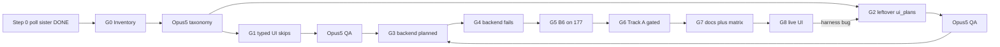

---
todos:
  - id: wait
    content: "STEP 0: this session polls qa-harness-improve memory.xml + DONE.md until DONE and next_steps STOP. Do not HALT. CONTINUE is only backup if THIS session dies."
    status: in_progress
  - id: g0
    content: "G0 Inventory: journey_matrix leftover holes after H4; Opus-5 taxonomy of UI-empty into skip vs ui_plan vs Track D"
    status: pending
  - id: g1
    content: "G1 Typed UI skips for HttpPassthrough / no_operator_ui / ping ABSENT / 2.2 RF; Opus-5 QA"
    status: pending
  - id: g2
    content: "G2 parallel UI Plan Authors for leftover ClientComposed/Orchestrated (bag, rename, extensions, NMEA, bridges, version chooser); Opus-5 QA per cluster"
    status: pending
  - id: g3
    content: "G3 Backend planned: NMEA socket, serial bridge fixture or skip, Ping Track D skip, camera POST /streams and POST /v4l with McmStreamRestore"
    status: pending
  - id: g4
    content: "G4 Backend fails: F-063 1.4-dev-aware switch on 177; F-075 disposition (no retry unless Opus says harness)"
    status: pending
  - id: g5
    content: "G5 B6 service-down on 177 only (tmux stop/respawn); catalog findings; never 2.2"
    status: pending
  - id: g6
    content: "G6 Track A: Opus-5 picks from the five listed candidates using W2 captures; composer adds JourneyId only after ACCEPT (max 5)"
    status: pending
  - id: g7
    content: "G7 Refresh RELEASE_READINESS.md + COVERAGE_PLAN hole; matrix planned=0, UI empty=0 except typed skips"
    status: pending
  - id: g8
    content: "G8 Live --ui for new plans (177/87/124 affinity); loop-back to G2 on harness bugs; never --ui on 2.2"
    status: pending
isProject: true
---

# QA 1.4-dev coverage closeout — orchestrator runbook

**Audience:** Orchestrator spawning **composer-2.5** workers and an independent **Opus-5** QA Reviewer. Local branch only. No PR. Commits only if the user asks.

**Do not start until** the sister campaign is finished:

- `catalog/extras/qa-harness-improve/DONE.md` exists
- that campaign's `memory.xml` `<next_steps>` is exactly `STOP`

Sister plan: [`.cursor/plans/QA harness improvement-ccf7f122.plan.md`](QA harness improvement-ccf7f122.plan.md). That campaign owns H0–H7 (crate types, annotations, runner, effect-read, **UI oracle H4**, body_kind, ratchet, live 177). Closeout **consumes** those landings. Racing `ui.rs` / `runner.rs` / `journey.rs` while H0–H7 run is forbidden.

**Campaign root:** [`catalog/extras/qa-1.4-closeout/`](catalog/extras/qa-1.4-closeout/)
**Orchestrator prompt:** [`ORCHESTRATOR_PROMPT.xml`](catalog/extras/qa-1.4-closeout/ORCHESTRATOR_PROMPT.xml)
**Continue (verbatim):** [`CONTINUE.md`](catalog/extras/qa-1.4-closeout/CONTINUE.md) — trigger `QA14CLOSE CONTINUE`
**Memory:** overwrite `catalog/extras/qa-1.4-closeout/memory.xml` (≤60 lines). Archive: append `memory_archive.md`.
**Live reports / findings:** keep using [`catalog/extras/qa-1.4-full/`](catalog/extras/qa-1.4-full/) (`reports/`, `FINDINGS.md`, `COVERAGE_PLAN.md`, `RELEASE_READINESS.md`).
**No iteration cap.** Session death → queued `QA14CLOSE CONTINUE` resumes `next_steps`. Campaign done → `DONE.md` + `next_steps: STOP`; leftover CONTINUE messages **halt** (no G8 again, no extra Track A, no extra B6, no follow-on). WAIT on sister unfinished is a per-message no-op, not Done — do not write STOP.

This campaign closes the **two-cell journey matrix** (backend HTTP vs UI Playwright) on live `bluerobotics/blueos-core:1.4-dev @ sha256:5b50dfafc3114651d459993c0c65639d7205634613fb62e0dea5ee04de8eebb1`. 100% is not every Vue click. Do not invent ~80 `JourneyId`s.



---

## Hard rules (orchestrator)

- NEVER implement, edit catalog sources, run `cargo`, or explore the tree yourself. Spawn composer-2.5.
- NEVER QA an artifact you (or the author) produced. Spawn a **fresh Opus-5** QA Reviewer (`claude-opus-5-thinking-high`).
- Merge only on **ACCEPT**. BOUNCE goes back to a new author instance with the bounce list.
- Every worker prompt is self-contained. Ends with: `Return ONLY: [deliverable]. Max 40 lines.`
- Spawn 1–3 workers per iteration. Prefer parallel independent clusters.
- Working memory is the source of truth. Re-read it at the start of every iteration.
- Work stays on this branch. Do not `git push`. Do not open a PR. Do not commit unless the user asks.
- Finding is never a stop. Live Fail → catalog finding, continue.
- **No iteration cap.** NEVER stop because the turn count is high. NEVER invent a max-iteration budget.
- Continuation trigger (verbatim): `QA14CLOSE CONTINUE` — see [`CONTINUE.md`](catalog/extras/qa-1.4-closeout/CONTINUE.md). Queue dozens. Cold start and resume use the **same** phrase.
- If the **session** is dying (context/network): write memory with remaining `next_steps` (**not** STOP unless Done criteria already met), append HANDOFF, end the turn so a queued CONTINUE resumes. That is a handoff, not campaign done.
- Write `DONE.md` and set `next_steps` to `STOP` **only** when Done criteria in the prompt are all true. After that, leftover CONTINUE messages are mandatory no-ops: short status, no spawn, no G8 again, no extra Track A, no extra B6, no follow-on.
- WAIT (sister harness-improve unfinished) is a **per-message no-op**. Do not write STOP. The next queued CONTINUE retries the wait gate.
- If closeout `DONE.md` exists and `next_steps` is `STOP`: HALT.
- **Poll files.** Task completion callbacks and `AwaitShell waiting_for_subagent` do not work here. Prefer blocking Task. For long live suites, poll `--report` JSON / log until complete.
- **Step 0 (this session):** poll sister `memory.xml` + `DONE.md` until DONE+STOP. Do not end the turn for “waiting”. Do not spawn G0 until green. `QA14CLOSE CONTINUE` is backup if **this** session dies.
- NEVER spawn G0–G8 workers while harness-improve is unfinished.
- NEVER execute harness-improve H0–H7 (wrong campaign).

---

## Roles

| Role | Model | Owns | Never |
|------|-------|------|-------|
| **Orchestrator** | Opus | Wait gate, spawn, ACCEPT/BOUNCE, memory, phase gates | Code, cargo, QA of the artifact |
| **Inventory Runner** | composer-2.5 | `journey_matrix --merge-report`; leftover hole list vs H4 landings | Editing sources |
| **Taxonomy Reviewer** | Opus-5 fresh | Classify each remaining UI-empty id: typed skip vs ui_plan vs Track D vs dual-required | Edit; invent JourneyIds |
| **Skip Engineer** | composer-2.5 | Matrix / runner typed UI skips (`http_is_operator_contract`, `no_operator_ui`, `no_sonar`, `would_strand_2.2`, `would_reboot`) | Skipping dual journeys; Playwright clones of HttpPassthrough |
| **UI Plan Author** | composer-2.5 | `ui_plan` for **one page cluster**; client-visible text/state; interpreter-only `UiAction` | New `UiAction` unless icon FAB forces `ClickSelector`; `--ui` on 2.2; rewriting H4 plans |
| **Live HTTP Runner** | composer-2.5 | One DUT, one `--smoke` / `--mutating-smoke` / `--negative` with restore + `--report` | Stop on Fail; strand 2.2; shutdown |
| **Live UI Runner** | composer-2.5 | One DUT, one `--ui --journey`; MCM restore on 87 camera; no SITL except 177 | `--ui` on 2.2; SITL on 87; legacy camera toggle |
| **B6 Runner** | composer-2.5 | 177 tmux stop of **one** service, hit the route, respawn, report real status | 2.2; stopping docker/nginx master; leaving service down |
| **Track A Author** | composer-2.5 | At most the five listed failure journeys after Opus ACCEPT + live capture | Guessing status codes; ~80 ids |
| **Docs Engineer** | composer-2.5 | `RELEASE_READINESS.md`, `COVERAGE_PLAN.md` current hole, `DONE.md` | Changing DUT roles |
| **QA Reviewer** | Opus-5 **fresh** | One worker output → ACCEPT/BOUNCE with evidence | Edit the artifact; review own work |

---

## What we will not build (bounce)

Pact, Gherkin, chaos, new crate, `JourneyStep` UI field, mechanical click clones of all Http journeys, SITL on 87/2.2, 2.2 RF hotspot, EEPROM/firmware brick, `ShutdownOnboardComputer`, product patches, hand-edits of `journey_presence.rs`, rewriting H4 ui_plans that already PASS QA.

---

## Already done (do not re-run as if missing)

- W0–W3 ×4 DUTs; W4 RF 177+124 10/10; W4 87 9/10 (F-075 connect timeout)
- W5 autopilot/board/SITL on 177; W6 reboot Pass; W6 switch Fail F-063
- Page-load 19/24 on 177 (F-070)
- `--ui` cal on 177 (F-066, compass `pass+F-068`); no-hw `--ui` 177 (F-071) and 124 (F-074)
- Camera `--ui` on 87 5/5 with `McmStreamRestore` (F-073); baseline `UDP Stream 0` → `udp://192.168.2.1:5600`
- SITL/`--ui` skip when no `sitl_frame`; `--journey` falls back to `ui_plan()`
- Ping hardware ABSENT ×4 (Track D)
- `vehicle_name=smoke-catalog` is W3 restore

Pre-closeout oracle (re-measure in G0 after H4): 79 present; backend 36 pass / 36 skip / 5 planned / 2 fail; UI 18 pass / 2 skip / 60 empty.

---

## Phases

Each phase: spawn workers → QA each output → merge ACCEPTs → update memory → next phase. Loop-back: G8 harness bug → G2.

### Step 0 — Poll sister campaign (this session, no HALT)

The operator will not be present. This orchestrator **keeps polling** until harness-improve is finished. `QA14CLOSE CONTINUE` is only if **this** session dies.

**Poll (every 2 minutes, no iteration cap):**

1. `catalog/extras/qa-harness-improve/DONE.md` exists?
2. `catalog/extras/qa-harness-improve/memory.xml` `<next_steps>` is exactly `STOP`?
3. Optionally note `<phase>` / `<in_flight>` for closeout memory (do not read their archive).

If either check fails: sleep 2 minutes, poll again. Do not spawn G0–G8. Do not write closeout `STOP`. Do not work H0–H7 for them.

If both pass: mark todo `wait` completed, set phase G0, proceed.

**Gate:** sister `DONE.md` + `STOP`. Then G0.

### G0 — Inventory (1 Inventory Runner, then 1 Opus-5 Taxonomy)

- `cd catalog && cargo run -q --offline --bin journey_matrix -- --merge-report extras/qa-1.4-full/reports`
- Diff UI-empty / backend-planned against H4 `ui_plan` landings and H2 skip mapping.
- Opus-5 produces a table: `journey_id → {ui: skip_reason | need_plan | already_green, backend: ok | planned | fail, dual, dut}`.
- Dual required: `rename_vehicle`, `modify_bag_database`, extension trio, video (already green), parameters (already green).
- HttpPassthrough → typed skip, not a Playwright clone.
- Ping / `enable_ping1d_rangefinder_mavlink` / `connect_ping_viewer_to_sonar` → `no_sonar`.
- `enable_legacy_camera_support` → `would_reboot` (never click the switch).

**Gate:** taxonomy ACCEPT. Orchestrator stores counts in memory, not the full table (put the table in archive via the agent writing `catalog/extras/qa-1.4-closeout/G0_TAXONOMY.md`).

### G1 — Typed UI skips (1 Skip Engineer + Opus-5)

Depends on G0 ACCEPT. Implement skip reasons in `journey_matrix` overlay (and runner if H2 already has `DutProfile` mapping). Do **not** skip dual-required ids. Do not mark `planned` as pass.

**Gate:** UI empty count drops to “need_plan” only. `cargo test --offline --lib journey_matrix`. QA ACCEPT.

### G2 — Remaining `ui_plan`s (parallel UI Plan Authors + Opus-5 per cluster)

Depends on G0. **One cluster per agent.** Skip clusters H4 already shipped.

Suggested clusters (drop any G0 marks green):

1. Bag + beacon: `modify_bag_database`, `rename_vehicle` (client-visible name/editor, not HTTP clone)
2. Kraken: `browse_extension_store`, `install_extension` dialog only unless fixture exists; uninstall/configure need install fixture or typed skip `installed_extension_required`
3. NMEA: `view_configured_nmea_sockets`, `add_external_nmea_gps_socket`, `remove_configured_nmea_socket` (restore socks)
4. Bridget: `view_configured_serial_bridges` already page-load; `create_serial_to_udp_bridge` / `remove_serial_bridge` need serial fixture or skip
5. Version chooser: `switch_local_blueos_version` UI is blocked by F-063 until G4; `update_blueos_version` / `pull_blueos_version_without_switch` — client-visible chooser, no actual switch
6. Helper/ping: `verify_internet_connectivity` may be HttpPassthrough skip; sonar → `no_sonar`

Playwright stays interpreter (`Open`, `Expect`, `Click`, `ClickIfVisible`, `WaitText`, `ExpectIframe`, `ClickSelector`, `ExpectGone`, `Sleep`). Client-visible text, not REST clones. `--ui` refused on 2.2. Camera/cal plans already exist — do not rewrite.

**Gate:** G0 `need_plan` list is empty or each leftover has a typed skip. QA ACCEPT per cluster.

### G3 — Backend planned (Live HTTP Runners)

Fill these five (or skip with reason):

| id | Action |
|----|--------|
| `add_external_nmea_gps_socket` | `--mutating-smoke` + restore DELETE /socks |
| `create_serial_to_udp_bridge` | provision serial fixture **or** typed skip `usb_serial_device` |
| `enable_ping1d_rangefinder_mavlink` | typed skip `no_sonar` (ABSENT ×4) |
| `configure_camera_stream` | 87: POST `/mavlink-camera-manager/streams` throwaway + restore via `McmStreamRestore` (UI already opened dialog) |
| `configure_uvc_device_controls` | 87: POST `/v4l` snapshot/restore or typed skip if no control API capture |

**Gate:** backend `planned` = 0. Stream baseline still running on 87. QA ACCEPT of reports.

### G4 — Backend fails (1 HTTP Runner + Opus-5)

- **F-063** `switch_local_blueos_version`: 1.4-dev-aware switch smoke on **177 only**. Do not guess tags. Do not leave the DUT off `1.4-dev @ sha256:5b50dfaf…ebb1`. If 412 is the live contract, finding stays and cell is `fail` or `pass_with_finding` per Opus.
- **F-075** `connect_to_wifi_network` on 87: first failure sticks. Opus labels product vs harness vs environment. Do not retry unless harness.

**Gate:** each fail has a finding id. Digest unchanged unless the switch wave explicitly moved and restored it.

### G5 — B6 service-down (1 B6 Runner + Opus-5)

Harness-improve deferred this. Closeout owns it. **177 only.** For a short allowlist (helper, bridget/linux2rest, mavlink2rest, nmea_injector — not docker, not nginx master, not 2.2): tmux stop → GET/POST the journey route → record status (must not be silent 200-with-success) → tmux respawn → `/status` 204.

**Gate:** each probed service has a finding or `probed` ledger row. Services left running. QA ACCEPT.

### G6 — Track A (Opus-5 decide, then Track A Author)

Promote **only** after live capture already in W2/NP reports. Candidates (from 1.4-full plan): unconfirmed dangerous op; invalid theme color (absent on 1.4-dev → skip `not_on_1.4-dev`); disallowed upload suffix (same); missing bag path; host command without ack. Max five. Source-anchored. `RejectInvalidWifiCredentials` remains the template. If Opus says none are ready, skip the phase with reason — that is ACCEPT.

**Gate:** either 0 new ids with written reason, or each new id has presence, HTTP probe, restore, and QA ACCEPT.

### G7 — Docs + matrix (1 Docs Engineer + Opus-5)

- Refresh `RELEASE_READINESS.md` pin to `sha256:5b50dfaf…ebb1`; include F-073–F-076 and closeout results.
- Update `COVERAGE_PLAN.md` current hole (or “none”).
- Write `catalog/extras/qa-1.4-closeout/DONE.md`.

**Gate:** matrix: UI empty = 0 among present (typed skip counts); backend planned = 0; both-empty gate still 0; presence contradiction F-069 still flagged not hand-edited.

### G8 — Live `--ui` (Live UI Runners)

Run new G2 plans on the DUT in the taxonomy (`177` default; camera-only 87; no-hw replicate 124). Separate `--journey` processes when restore Drop matters. Poll report JSON. Loop-back to G2 on harness bugs only.

**Gate:** every new `ui_plan` has `pass` / `pass_with_finding` / typed skip in the merged matrix.

---

## Worker prompt skeleton (orchestrator MUST use)

```text
You are the [Role]. Load [skill path] if listed. Follow catalog rules on glob match.

Mission: [one sentence]
Files you may edit: [exact paths]
Do not edit: [paths]
Invariants: no new JourneyId unless this prompt is G6 after Opus ACCEPT;
  no lab IPs on UserJourney; 2.2 never stranded; never --ui on 2.2;
  SITL --ui only 177; never toggle legacy camera; 87 camera restore UDP Stream 0;
  wifi RF gold; findings never stop a wave; do not rewrite H4-accepted ui_plans;
  Playwright interprets UiAction only; no JourneyStep UI field;
  poll reports (callbacks broken); local only, no commit/PR unless asked HERE.
Done: [gate commands]
Forbidden: [phase forbidden list]

Return ONLY: files changed or reports written; test/matrix result; remaining holes;
  anything you refused. Max 40 lines.
```

QA prompt: model `claude-opus-5-thinking-high`; skill `blueos-catalog-validate` when reviewing catalog diffs; review **one** author output; ACCEPT or BOUNCE with evidence; do not edit. Fresh Task spawn.

---

## Memory template (overwrite every iteration)

```xml
<working_memory last_updated="iteration N @ ISO-8601">
  <recovery>Read catalog/extras/qa-1.4-closeout/ORCHESTRATOR_PROMPT.xml — ORCHESTRATOR only. Wait on harness-improve DONE+STOP.</recovery>
  <phase>WAIT|G0|...</phase>
  <confirmed_findings>- ...</confirmed_findings>
  <in_flight>agent → cluster → status</in_flight>
  <last_results>ACCEPT/BOUNCE / live counts</last_results>
  <next_steps>- [Phase Gx] spawn ...</next_steps>
  <blocked_on>harness-improve | Nothing | BOUNCE on cluster X</blocked_on>
</working_memory>
```

Archive one block per iteration: hypothesis, agents, verdicts, decision.

---

## Invariants that must not move

- Findings never stop a wave.
- 2.2 never stranded; SITL/`--ui` arming 177 only; one host radio.
- Track B stays on existing ids unless G6 ACCEPT.
- Playwright interprets; Rust owns plans.
- Product facts on journeys; lab IPs stay in runner/`DutProfile`.
- Do not hand-edit `journey_presence.rs` (F-069 stays a contradiction flag).

## How to run

1. Finish (or wait for) **QAHARNESS CONTINUE** until that `DONE.md` + `STOP`.
2. Open a **new Agent chat** as orchestrator.
3. Paste the fenced block in [`catalog/extras/qa-1.4-closeout/CONTINUE.md`](catalog/extras/qa-1.4-closeout/CONTINUE.md) as the first message (`QA14CLOSE CONTINUE`).
4. Queue **dozens of the same block** as follow-ups (if **this** Step-0 session dies). Each copy:
   - Step 0: poll sister until DONE+STOP (2 min cadence; do not write STOP; do not spawn G0–G8)
   - resumes G0–G8 `next_steps` if closeout is unfinished and sister is done
   - **halts** if closeout `DONE.md` + `STOP` (no further work even if many copies remain)
5. Do not add extra mission text to those messages.

Cold start and resume use the **same** phrase. Memory starts at WAIT. There is no iteration cap.
